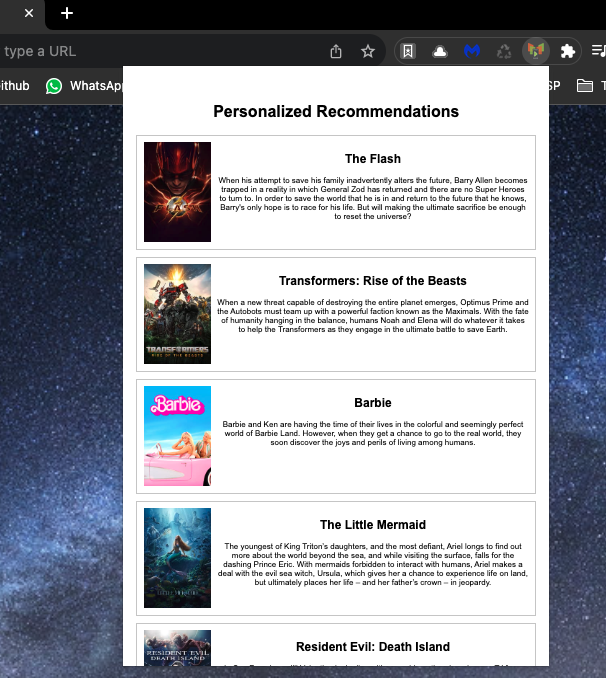
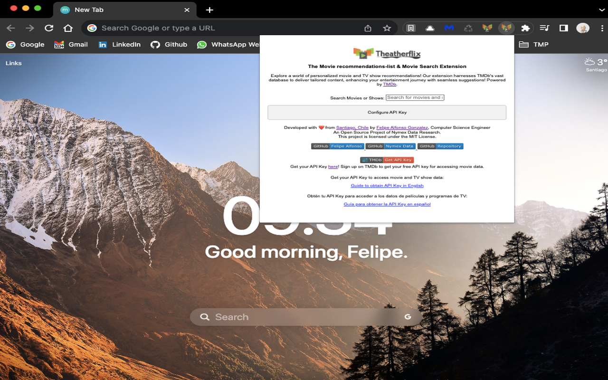
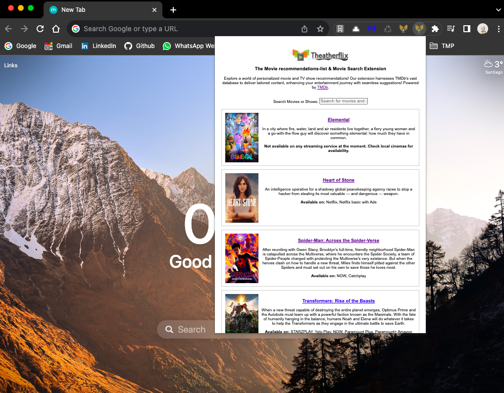
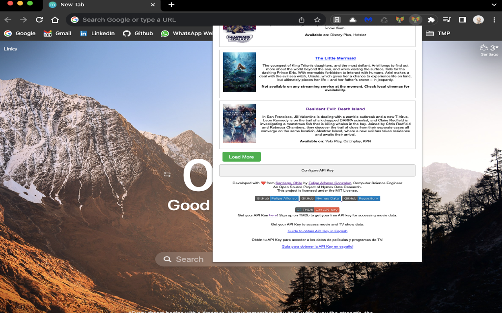

# Theatherflix 

#

> Felipe Alfonso González - Creator / Computer Science Engineer - https://github.com/felipealfonsog  | <a href="mailto:f.alfonso@res-ear.ch">f.alfonso@res-ear.ch</a>.

> *Logo created by <!-- Afolayan Stephen | --> https://github.com/dee-y  | (Graphic Designer - Contributor).
#

Theatherflix Extension is a browser extension that provides personalized movie and series recommendations to users. Using The Movie Database (TMDb) API, the extension fetches popular movie data and displays customized suggestions based on user preferences. By leveraging TMDb's extensive movie and series information, users can discover exciting titles and find their next favorite entertainment without the need for a Netflix API. The extension offers a seamless and enjoyable browsing experience, making it an ideal companion for movie enthusiasts looking to explore diverse content.

Theaterflix is a browser extension that provides personalized movie and series recommendations. It's built using HTML, CSS, and JavaScript, and it leverages the TMDb API to fetch data about movies and TV shows. Users can configure the extension by entering their TMDb API key. In the future, we plan to enhance the recommendation system with machine learning and expand compatibility to other browsers. The goal is to create a seamless and delightful user experience for discovering new content based on individual preferences.

The extension uses JavaScript to handle user interactions, such as displaying and hiding the configuration section using an accordion-style UI. It also fetches data from the TMDb API asynchronously and dynamically updates the UI with the fetched information.

In the future, this project aims to incorporate advanced machine learning algorithms to deliver even more accurate and personalized movie and series recommendations. It will expand its reach to support multiple browsers, catering to a broader user base. Continuous updates and improvements will be implemented to stay up-to-date with the latest trends and user preferences. The ultimate goal is to become a go-to tool for entertainment discovery, providing users with an engaging and effortless content exploration experience.

#

<!--
https://chrome.google.com/webstore/detail/theaterflix-extension/phakiffpjmnaecdckgjiillpcmlmlhhg
-->

🚀 Exciting news! 🎉 The Theaterflix Extension has been successfully approved by Google and is now available for download on the [Chrome Web Store](https://chrome.google.com/webstore/detail/theaterflix-extension/phakiffpjmnaecdckgjiillpcmlmlhhg)! 🎥🍿✨ Experience personalized movie and series recommendations like never before. 😍💡 Explore the world of entertainment with ease and discover your next favorite watch! 🌟 Get it now from the Chrome Web Store: 

 

 🎖️🔥
#### YouTube Video

  

#

<!-- 

-->

 

#### 🚀 Project Transition: From Movie Trailer Organizer to Personalized Streaming Extension 🎬

Theatherflix was initially conceived as a visual tool for organizing digital movie trailers, sorting and listing the top latest movie trailers. 🎥 The main objective was to provide a comprehensive platform that catered to individuals with limited internet access or no subscription to streaming services. 🌐 The project aimed to offer a complete, free-to-use platform that could be installed on various servers, computers, or devices to watch movie trailers.

However, we have recently undergone a transition in our project's focus. 🔄 We are now developing Theatherflix as a browser extension. The new vision for Theatherflix is to create an extension that provides personalized movie and series recommendations, enhancing the user's streaming experience with tailored content suggestions. 📺🍿

By shifting to an extension-based approach, we aim to offer a seamless integration with popular streaming platforms like Netflix. 🎉 Users will be able to receive personalized recommendations directly within their browser while using Netflix, making it easier for them to discover new content they might enjoy.

We believe this transition will better serve our users, as it allows for a more direct and user-friendly interaction with the streaming platforms they are already using. 🤝 We are committed to continuous development and will keep updating the extension to meet the evolving needs and preferences of our users.

Stay tuned for more updates as we continue to work on Theatherflix Extension and improve its functionality to provide the best personalized streaming recommendations for our users. 👀

Thank you for being a part of this exciting journey with us! 🙌 If you have any feedback or suggestions, feel free to contribute or reach out to us. Together, let's make streaming entertainment more enjoyable for everyone. 🎉🍿
🍿
🎉🍿

#

#### Installation

Exciting news! Our extension will soon be available for Chrome users, providing enhanced functionality and convenience right in their browsers. We are working diligently on making it available to a wider audience. Moreover, we have fantastic plans to develop a Firefox Extension as well, catering to users across different platforms and browsers. Stay tuned for updates as we continue to innovate and expand our extension's capabilities to deliver the best possible experience to our users. Your support and feedback are invaluable in driving us towards a more versatile and accessible extension ecosystem. Together, we are shaping the future of our extension, ensuring it remains at the forefront of technology and usability. Thank you for joining us on this exciting journey!

#### Screenshots

<!-- 

--->

  

  

  

#

#### Technical stuff*:

    ---------------------------------------------------------------------------------------------------------------------------------
      If you are one of the engineers, developers, someone documenting or a tester, don't forget there's a branch called 'development'. We must use that first before to make a pull request to the master. 
      Create any issue about moving files etc. We in that way can avoid any kind of conflict regarding files or programming.
      Thanks!

#### Development

**Don't write initially in the master branch, all first goes to development**. then we pull request to master which is 'Production'.
If you want to download the whole development files, go to the 'development' branch -> 
https://github.com/NymexData/Theatherflix/tree/development

#If you want to clone the development branch follow this:
1. `git clone -b development --single-branch git@github.com:NymexData/Theatherflix.git`
2. `cd development` (which is downloaded as a folder named 'Theatherflix' though, you rename it)

#### Contributing

Before raising a pull-request, please read all carefully

This project adheres to the [Contributor Covenant 1.4](http://contributor-covenant.org/version/1/4/).
 By participating, you are expected to uphold this code. Please report unacceptable
 behavior to any of the [project's core team]

| We need more collaborations or people involved in this modest project which I think it could be cool, actualy initially behind Theatherfli there was a different idea, but now,  we have a different idea, I hope this new concepto for the project could work :).

#### Join the conversation about Theatherflix using Slack!
https://nymexdata.slack.com/
#### **Note:** 
_Feel free to contact Felipe: f.alfonso@res-ear.ch if you wanna Fork the project to try something unique, and learn and test, and feel an Open Source Project in your hands too._

#### Authors and contributors from the previous concept of the project.

| Names of collaborators         | Github Links          | Remarks
| ------------------ |:------------------- |:--------------
| Felipe     | https://github.com/felipealfonsog | (Founder - f.alfonso@res-ear.ch)
| Antz      | https://github.com/antzshrek | (Main Collaborator - Management)
| Dee-y      | https://github.com/dee-y  | (Graphic Designer - Contributor)
| Gonzalrick   | https://github.com/gonzalrick | (Collaborator)
| Vikas Singh Rajput    | https://github.com/rajvicky | (Collaborator)
| Bhagvat Lande         | https://github.com/BMLande    | (Collaborator)
| Prabhpahul  Singh     | https://github.com/prabhpahul | (Collaborator)
| Mmajidali             |https://github.com/mmajidali40 | (Collaborator)
| Hiago Machado         | https://github.com/HiagoMachado777 | (Collaborator)
| Patelvvipulgk         | https://github.com/patelvipulgk | (Collaborator) 
| Parikshit Hooda       | https://github.com/Parikshit-Hooda | (Collaborator)
| Douglas Alves         | https://github.com/dougtq | (Collaborator)
| Naimur Rahman Sourov  | https://github.com/nsourov | (Collaborator)
| Jpart                 | https://github.com/jpart-r | (Collaborator)

If you are not in the list, reach out to Felipe - f.alfonso@res-ear.ch

#### Copyright and license
 
Copyright JS Foundation and other contributors, http://js.foundation under the MIT LICENSE.

Founded and Started by Computer Science Enginer: Felipe Alfonso Gonzalez / EMail: f.alfonso@res-ear.ch / CC2018-Present.

#### Support ☕

Your support and contributions are greatly appreciated! Thank you for your help in making this project better. 🙌

- 
- 
- 

